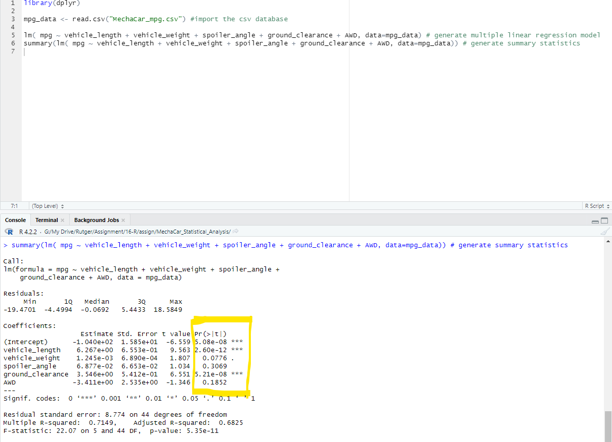
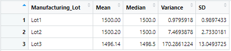
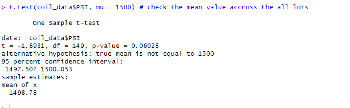
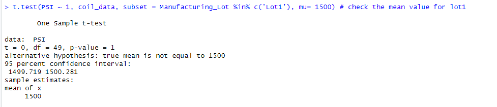
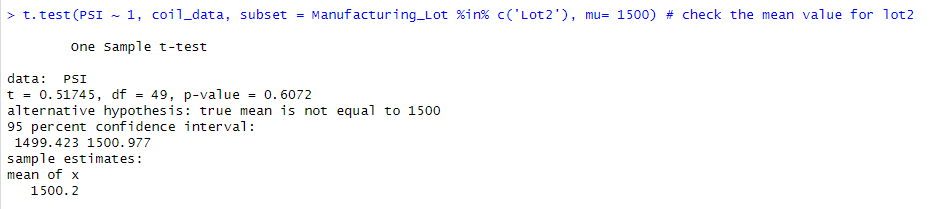
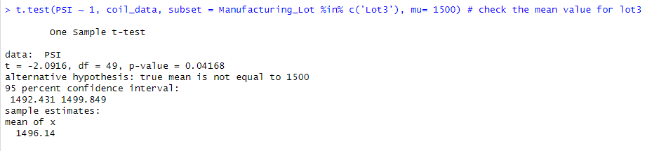

# MechaCar_Statistical_Analysis

## Linear Regression to Predict MPG

    From above mentioned multiple regression analysis is to examine the associated p-value, at the bottom of model summary to determine which variable provide a significant contribution.

    In the summary output, individual Pr(>|t|) value represents the probability that each coefficient contributes a random amount of variance to the linear model. As per summary results vehicle length and ground clearance are statistically unlikely to provide random amounts of variance to the linear model. So it is observed the vehicle length and ground clearance have a significant impact on MPG. When an intercept is statistically significant, it means there are other variables and factors that contribute to the variation in MPG that have not been included in our model. These variables may or may not be within our dataset and may still need to be collected or observed.

* Which variables/coefficients provided a non-random amount of variance to the mpg values in the dataset? 
    ~ A: As per summary results vehicle length and ground clearance are statistically unlikely to provide random amounts of variance to the linear model.

* Is the slope of the linear model considered to be zero? Why or why not?
    ~A: We have observed random amounts of variation for vehicle length and round clearance and coefficients value is more than 9.56 & 6.55 so this model should not considered slope zero.

* Does this linear model predict mpg of MechaCar prototypes effectively? Why or why not? 
    ~ A: It is observed that When an intercept is statistically significant, it means there are other variables and factors that contribute to the variation in MPG that have not been included in our model. These variables may or may not be within our dataset and may still need to be collected or observed.

## Summary Statistics on Suspension Coils

* Total Summary of Suspension Coils:

    

* Lot Summary of Suspension Coils:

    

    The design specifications for the MechaCar suspension coils dictate that the variance of the suspension coils must not exceed 100 pounds per square inch. Does the current manufacturing data meet this design specification for all manufacturing lots in total and each lot individually? Why or why not? ~ A: No, manufacturing data does not mee the design specification of variance as Lot# 3 variance is 170.29 which is higher than design specification 100. However Lot#1 and Lot#2 have achieved the requirement.

## T-Tests on Suspension Coils:
* t.test() Funciton to check PSI accross all manufacturing lots with Population mean of 1500 PSI.

    
We have observed the p-value is more 5.0, this suggesting that it is failed to reject NULL hypothesis. There is not sufficient evidence to prove that sample mean of all manufactured lots is different than population mean.

 * t.test() t.test() Funciton to check PSI of manufacturing Lot1 with Population mean of 1500 PSI.  

    
We have observed the p-value is more 5.0, this suggesting that it is failed to reject NULL hypothesis. There is not sufficient evidence to prove that sample mean of manufacured Lot1 is different than population mean.

 * t.test() t.test() Funciton to check PSI of manufacturing Lot2 with Population mean of 1500 PSI.  

    
We have observed the p-value is more 5.0, this suggesting that it is failed to reject NULL hypothesis. There is not sufficient evidence to prove that sample mean of manufacured Lot2 is different than population mean.

 * t.test() t.test() Funciton to check PSI of manufacturing Lot3 with Population mean of 1500 PSI.  

    
We have observed the p-value is 4.2 less than 5.0, this suggesting that NULL hypothesis is rejected. There is sufficient evidence to prove that sample mean of manufacured Lot3 is statistically different than population mean.

## Study Design: MechaCar vs Competition:
        MechaCar has been continuously concentrated on cars performance to make automotive products perform to their best abilities. Different car performance tests are included real on-road experience with public road and closed track testing, as well as High Fuel efficiency testing, Acceleration system/Deceleration system, Safety, data acquisition and comprehensive reporting, accelerated mileage accumulation testing, EV infrastructure testing and energy storage systems cycling and performance measure, fleet vehicle monitoring, and much more both in lab and field environments. 

        Components, automotive systems, and end products are reliably evaluated and performance tested. There is a particular focus on advanced technology vehicles for industry, government agencies, and fleets helps deliver strong, actionable results. Services such as vehicle and electric battery testing for hybrid and electric vehicles keep new technology at the forefront of performance achievement.

    Following matrics is considered,

*   High fuel efficiency.
*   Acceleration system/Deceleration system.
*   Safety.

### NULL Hypothesis:
*   Do MechaCar has high fuel efficiency in mid sedan car range?
    Hypothesis - if MechaCar mid sedan car range (2.5l engine) up to 5 years of old car achieves 42 MPG fuel efficiency with compare to compotator’s X car 38 MPG fuel efficiency.
    
    Null Hypothesis - if MechaCar's special fuel injecting system in mid sedan car range (2.5l engine) up to 5 years of old car does not achieve 42 MPG fuel efficiency with compare to compotator’s X car 38 MPG fuel efficiency.

    Alternative Hypothesis - if MechaCar's special fuel injecting system in mid sedan car range (2.5l engine) up to 5 years of old car achieve 42 MPG fuel efficiency with compare to compotator’s X car 38 MPG fuel efficiency.
        
    With help of paired t-test statistical test will be used to compares the average/means and standard deviation of two cars group data for significant differences. 
	
	Car company’s (MechaCar and competitor X)cloud system capture the customers MPG data every end of month remotely and save on cloud servers. 

*   Do MechaCar’s X model can achieve 0-60 Mile acceleration in 6 sec with Deceleration of 60-0 mile in 4 sec with compare to competitors X car model?

    Null Hypothesis - if MechaCar's X model in mid sedan car range (2.5l engine) does not achieve 0-60 mile acceleration and Deceleration of 60-0 mile within 4 sec compare to compotator’s # car Y model.

    Alternative Hypothesis - if MechaCar's X model in mid sedan car range (2.5l engine) does achieve 0-60 mile acceleration and Deceleration of 60-0 mile within 4 sec compare to compotator’s # car Y model.

    With help of paired t-test statistical test will be used to compares the average/means and standard deviation of two cars group data for significant differences. 

    Company’s test data for Acceleration and Declaration can be used to verified actual car acceleration and Deceleration performance.

*   Do MechaCar’s Y model has premium safety feature, so run more than 50K mile in year & have minimum fetal cars accidents with compare to competitor?

    Null Hypothesis - if MechaCar's Y model has premium safety feature, so run more than 50K mile in year & have higher fetal cars accidents with compare to competitor.

    Alternative Hypothesis - if MechaCar's Y model has premium safety feature, so run more than 50K mile in year & have less fetal cars accidents with compare to competitor.        
    
    With help of paired t-test statistical test will be used to compares the average/means and standard deviation of two cars group fatal accident data for significant differences. 
    
    Consumers data for fatal accidents can be used to verified actual car safety performance.

        

